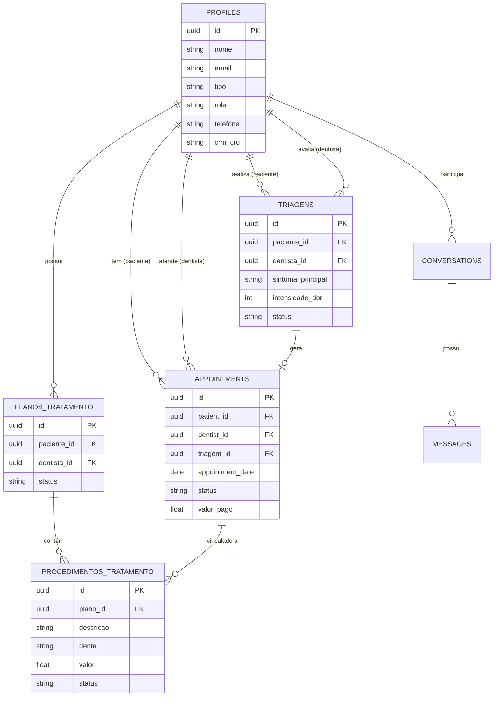

# Capítulo II – Apresentação do Projeto TeOdonto

## 1. Requisitos do Sistema

Os requisitos foram levantados com base nas necessidades reais de uma clínica odontológica, dividindo-se entre Funcionais (o que o sistema faz) e Não Funcionais (como o sistema se comporta técnica e operacionalmente).

### 1.1. Requisitos Funcionais (RF)

| Código | Nome do Requisito | Descrição |
| :--- | :--- | :--- |
| **RF01** | Gestão de Usuários e Perfis | O sistema deve permitir o cadastro, edição e autenticação de usuários com diferentes níveis de acesso (Paciente, Dentista, Secretário e Admin). |
| **RF02** | Triagem Digital | O sistema deve possuir um módulo onde pacientes possam realizar uma pré-triagem digital, relatando sintomas e intensidade da dor. |
| **RF03** | Agendamento de Consultas | O sistema deve permitir que pacientes solicitem agendamentos, escolhendo a data e o motivo da consulta. |
| **RF04** | Gestão de Recepção | O sistema deve fornecer à Secretaria a capacidade de gerenciar, confirmar, cancelar ou reagendar todos os agendamentos e triagens da clínica. |
| **RF05** | Atribuição Profissional | O sistema deve permitir que a Secretaria atribua um Dentista específico para atender a triagem ou o agendamento de um paciente. |
| **RF06** | Painel Exclusivo do Profissional | O sistema deve garantir que cada Dentista visualize apenas as triagens e os agendamentos de pacientes que lhe foram atribuídos. |
| **RF07** | Prontuário e Evolução Clínica | O sistema deve permitir que o Dentista registre, consulte e atualize as evoluções clínicas do paciente após cada atendimento. |
| **RF08** | Emissão de Prescrições | O sistema deve permitir que o Dentista crie e gerencie receitas digitais (prescrições) para os pacientes. |
| **RF09** | Controle Financeiro | O sistema deve possuir um módulo financeiro que permita registrar procedimentos e acompanhar o status de pagamento (Pendente, Parcial ou Pago). |
| **RF10** | Comunicação Interna (Chat) | O sistema deve fornecer um chat interno para a troca de mensagens diretas entre os pacientes e a clínica. |
| **RF11** | Painel Administrativo | O sistema deve fornecer ao Administrador um dashboard com métricas gerais da clínica (total de pacientes, receita, profissionais ativos). |

### 1.2. Requisitos Não Funcionais (RNF)

| Código | Categoria | Descrição |
| :--- | :--- | :--- |
| **RNF01** | Segurança (LGPD) | O sistema deve utilizar controle rigoroso de acesso (RLS) para garantir que informações clínicas sejam acessadas apenas por usuários autorizados. |
| **RNF02** | Multiplataforma | A interface do sistema deve ser construída (*React Native*) para funcionar de forma responsiva tanto em navegadores web quanto em dispositivos móveis. |
| **RNF03** | Desempenho (Tempo Real) | O sistema deve refletir mudanças críticas de forma instantânea (como alteração de status de consulta), utilizando a tecnologia de Websockets do Supabase. |
| **RNF04** | Disponibilidade e Offline | O sistema possui arquitetura híbrida de conectividade, utilizando fila de sincronização (Sync Queue) e armazenamento em cache local (AsyncStorage) para permitir leitura e registro de dados mesmo durante quedas de internet. |
| **RNF05** | Usabilidade (UX) | O sistema deve possuir interfaces limpas e painéis específicos para cada tipo de usuário, diminuindo a curva de aprendizado. |
| **RNF06** | Integridade de Dados | O banco de dados relacional (PostgreSQL) deve assegurar regras de consistência, impedindo exclusões acidentais de registros que possuam dependências. |

---

## 2. Descrição dos Diagramas UML

A modelagem UML (Linguagem de Modelagem Unificada) foi utilizada para planejar e documentar a estrutura arquitetural e comportamental do sistema TeOdonto.

### 2.1. Descrição do Diagrama de Casos de Uso
O Diagrama de Casos de Uso tem como objetivo mapear as interações entre os usuários (chamados de atores) e as funcionalidades que o sistema oferece. No TeOdonto, identificamos quatro atores principais:
*   **Paciente:** Interage com o sistema para preencher sua triagem digital, solicitar agendamentos de consultas, visualizar seu histórico médico e trocar mensagens com a clínica.
*   **Secretário(a):** Atua como o intermediário operacional. Este ator tem acesso a todos os agendamentos e triagens globais da clínica. Suas ações incluem confirmar consultas, atribuir um paciente a um Dentista específico e gerenciar recebimentos financeiros básicos.
*   **Dentista:** O foco deste ator é clínico. Ele interage com o sistema para visualizar a sua própria agenda, acessar a ficha clínica do paciente atribuído, registrar as evoluções do tratamento, emitir prescrições e gerenciar os procedimentos realizados no Odontograma.
*   **Administrador:** Possui o maior nível de privilégio. Além de herdar as permissões da secretaria, este ator interage com o sistema para extrair relatórios financeiros e gerenciar perfis de funcionários.

### 2.2. Descrição do Diagrama de Classes
O Diagrama de Classes representa a estrutura estática orientada a objetos do sistema, demonstrando como os dados são encapsulados nas regras de negócio da aplicação (Frontend). 
A classe base do sistema é a classe abstrata `Usuario`, que possui atributos universais (ID, Nome, Email). Desta classe, herdam as classes `Paciente`, `Dentista`, `Secretario` e `Admin`, ganhando comportamentos específicos.
As classes de operação incluem `Agendamento`, que se relaciona diretamente com `Paciente` e `Dentista` (um paciente pode ter vários agendamentos, um dentista pode atender vários agendamentos). A classe `Agendamento` pode gerar um objeto `Triagem` (motivo clínico) e se vincula a um `Pagamento` (status financeiro), garantindo que toda a regra de negócio odontológica esteja devidamente mapeada no código.

---

## 3. Diagrama Entidade-Relacionamento (DER)

Enquanto o Diagrama de Classes mapeia a estrutura da aplicação, o Diagrama Entidade-Relacionamento (DER) mapeia a estrutura física do **Banco de Dados Relacional (PostgreSQL / Supabase)**. Abaixo está a representação visual (em formato Mermaid) de como as tabelas do sistema se conectam.

*Nota para o TCC: Você pode copiar o bloco de código acima e colar no site mermaid.live para baixar a imagem do banco de dados.*
