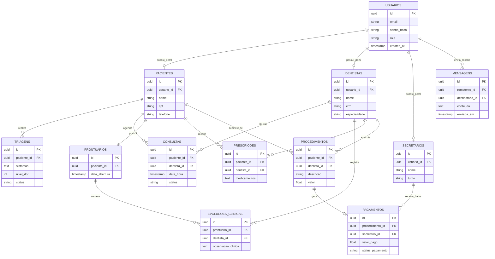

### 2.3.4 Diagrama Entidade-Relacionamento (DER)

O Diagrama Entidade-Relacionamento (DER) é uma técnica de modelagem de dados utilizada para representar de forma gráfica a estrutura lógica de um banco de dados, identificando as entidades, os seus atributos e os relacionamentos existentes entre elas. Esta abordagem é essencial no processo de desenvolvimento de sistemas de informação, pois permite visualizar como os dados serão organizados, armazenados e relacionados dentro da base de dados.

No contexto do TeOdonto, o DER foi utilizado como instrumento de apoio para estruturar o banco de dados do sistema de gestão odontológica, garantindo consistência, integridade e eficiência no armazenamento das informações clínicas e administrativas da clínica.

A construção do DER permitiu identificar as principais entidades do sistema, entre elas:

*   **Usuários** – entidade responsável por armazenar os dados gerais de autenticação e identificação dos utilizadores do sistema;
*   **Pacientes** – armazena os dados pessoais e clínicos dos pacientes;
*   **Dentistas** – contém informações profissionais dos dentistas vinculados ao sistema;
*   **Secretários** – responsável pelos dados administrativos da recepção;
*   **Triagens** – regista os sintomas e informações iniciais submetidas pelo paciente;
*   **Consultas** – armazena os agendamentos e atendimentos clínicos realizados;
*   **Prontuários** – centraliza o histórico clínico completo do paciente;
*   **Evoluções Clínicas** – regista o acompanhamento detalhado do tratamento realizado pelo dentista;
*   **Prescrições** – armazena receitas médicas e orientações clínicas;
*   **Procedimentos** – regista os tratamentos odontológicos executados;
*   **Pagamentos** – controla os valores financeiros referentes aos procedimentos realizados;
*   **Mensagens** – gerencia a comunicação interna entre os diferentes perfis do sistema.

A modelagem das relações entre estas entidades permitiu definir as cardinalidades do sistema. Por exemplo, um paciente pode realizar várias consultas, mas cada consulta pertence a um único paciente. Da mesma forma, um dentista pode atender vários pacientes, e cada atendimento pode gerar múltiplos procedimentos e evoluções clínicas.

O DER também garantiu a implementação de regras de integridade referencial no banco de dados, impedindo inconsistências, como a exclusão de um paciente que possua consultas, prontuários ou pagamentos associados. Isso reforça a confiabilidade do sistema e a segurança das informações armazenadas.

A utilização do DER no desenvolvimento do TeOdonto foi fundamental para assegurar uma base de dados bem estruturada, preparada para suportar operações em tempo real, múltiplos acessos simultâneos e futuras expansões do sistema.

**Figura 3 - Diagrama Entidade-Relacionamento (DER)**

